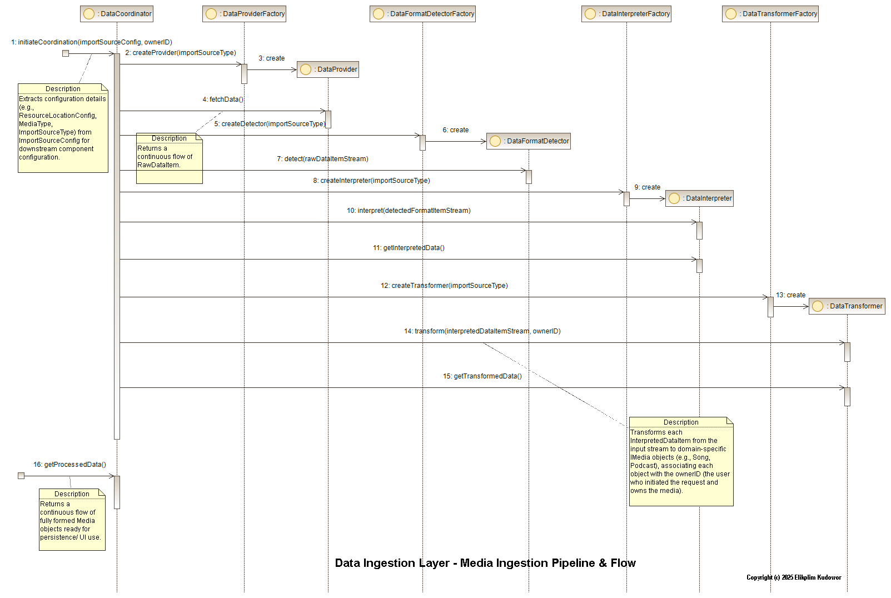

# Cosmos Media: Data Ingestion Layer (DIL) - Minimum Viable Implementation (MVI)

## Project Overview

Welcome to the Data Ingestion Layer (DIL) Minimum Viable Implementation (MVI) for the **Cosmos Media** platform! This project serves as a proof-of-concept for a robust, modular, and extensible data pipeline designed to ingest various media types from diverse sources, process their metadata, and transform them into structured domain objects.

This MVI focuses on demonstrating the core architectural principles and the end-to-end flow of data from a local file system source, specifically for `song` media type (MP3 files).

## Architectural Highlights

The DIL is built with a strong emphasis on **Clean Architecture** and **Domain-Driven Design** principles, featuring:

* **Layered Design:** Clear separation between core utilities, domain entities, and the data ingestion logic.

* **Dependency Inversion Principle (DIP):** Interfaces (abstract classes in Dart) define contracts, allowing for flexible and swappable concrete implementations.

* **Strategy Pattern:** Dynamic selection of specialized algorithms for:

    * **Data Retrieval:** Fetching raw data from different sources (e.g., local file system, cloud storage).

    * **Data Format Detection:** Identifying the precise format of raw data (e.g., MP3, MP4).

    * **Data Interpretation:** Extracting structured metadata from raw data.

    * **Data Transformation:** Mapping interpreted metadata into rich domain entities (e.g., `Song` objects).

* **Factory Pattern:** Dedicated factory classes are used to encapsulate the creation logic of DIL components and strategies, promoting loose coupling and making it easy to introduce new implementations without modifying client code.

* **Mediator Pattern:** The `DataCoordinator` acts as a central orchestrator, managing complex interactions between DIL components (Providers, Detectors, Interpreters, Transformers) and reducing direct dependencies between them.

* **Reactive Programming (Dart Streams):** Data flows asynchronously and continuously through the pipeline using Dart's `Stream` API, ensuring non-blocking operations and efficient processing.

* **Comprehensive Error Handling:** A standardized `AppException` system with rich context ensures that errors are caught, logged, and propagated gracefully through the pipeline, allowing for robust recovery or clear diagnostics without halting the entire process.

* **Dependency Injection (GetIt):** A lightweight service locator (`get_it` package) is used to manage component dependencies, promoting testability and modularity.

## Architectural Diagram

Here is a visual representation of the Data Ingestion Layer pipeline. These diagrams illustrate the main components relations, flow of data through the main components, and their interactions, highlighting the modular and stream-based nature of the design.


> 📊 *Visual representation of the Cosmos Media data ingestion pipeline architecture*


> 📊 *Visual representation of the Cosmos Media data ingestion pipeline components interactions*

## Getting Started

Follow these steps to set up the project and run the demonstration on your local machine.

### Prerequisites

* [Flutter SDK](https://flutter.dev/docs/get-started/install) (includes Dart SDK) installed and configured.

    * Ensure your Flutter version is compatible with `environment: sdk: '>=3.0.0 <4.0.0'` specified in `pubspec.yaml`.

* A code editor (e.g., VS Code, IntelliJ IDEA with Dart/Flutter plugins).

### 1. Clone the Repository

```bash
git clone https://github.com/Hou-dini/cosmos-media-mvi
cd cosmos-media-mvi

````

### 2\. Install Dependencies

Navigate to the project root directory (`cosmos-media-mvi/`) and fetch the Dart/Flutter dependencies:

```bash
flutter pub get

```

## Running the Demonstration

The `main.dart` file includes a test harness that sets up a dummy local directory, runs the DIL pipeline, and prints status updates and processed data to the console.

### 1\. Run the Successful Path Demonstration

This will show the pipeline successfully processing valid MP3 files.

```bash
dart run lib/main.dart

```

**Expected Output:** You will see logs indicating DI setup, dummy data creation, status updates from the DIL pipeline, and successfully processed `Song` objects. The summary at the end should show "Total Errors Encountered in Pipeline: 0".

### 2\. Run the Abnormal Path (Error Handling) Demonstration

This demonstrates how the DIL gracefully handles unsupported file formats.

**Step 2.1: Modify `LocalSongRetrievalStrategy`**

Open `lib/src/data_ingestion_layer/implementations/strategies/data_retrieval/local_song_retrieval_strategy.dart`.

**Find this section:**

```
          final fileExtension = p.extension(entity.path).toLowerCase();
          // For MVI, we're focusing on 'song' media type, and assuming MP3 format.
          // In a full implementation, this would involve a more robust format detection
          // or delegation to a specialized helper.
          if (fileExtension == '.mp3') {
            yield RawDataItem<File>(
              data: entity,
              sourceIdentifier: entity.path,
              formatHint: DataFormat.mp3.name, // Provide a hint
            );
          }
```

**Comment out the `if` condition so it looks like this:**

```
          final fileExtension = p.extension(entity.path).toLowerCase();
          // For MVI, we're focusing on 'song' media type, and assuming MP3 format.
          // In a full implementation, this would involve a more robust format detection
          // or delegation to a specialized helper.
          // if (fileExtension == '.mp3') { // COMMENT OUT THIS LINE
            yield RawDataItem<File>(
              data: entity,
              sourceIdentifier: entity.path,
              formatHint: DataFormat.mp3.name, // Provide a hint
            );
        // } // COMMENT OUT THIS LINE
```

**Step 2.2: Run the Demonstration Again**

```bash
dart run lib/main.dart

```

**Expected Output:** You will now see:

  * Similar setup and processing for valid MP3 files.

  * A `❌ Pipeline Error:` log, specifically an `AppException` with `ErrorCode.dilFormatDetectionUnsupported` originating from `LocalDataFormatDetector` for the `Invalid File.txt`.

  * The pipeline will continue processing other valid files (due to `cancelOnError: false` in stream listeners).

  * The summary at the end should show "Total Errors Encountered in Pipeline: 1".

### 3\. Revert `LocalSongRetrievalStrategy` (Important\!)

After testing the error path, **remember to revert the change** in `lib/src/data_ingestion_layer/implementations/strategies/data_retrieval/local_song_retrieval_strategy.dart`.

**Restore the `if` condition to its original state.** The intended behavior of `LocalSongRetrievalStrategy` is to filter for MP3s at the source.

## Contributing

This project is an MVI and is open for future expansion. Feel free to explore, provide feedback, or suggest improvements.

## License

This project is licensed under the MIT License - see the [LICENSE](LICENSE) file for details.

**Designed and Developed by Elikplim Kudowor**
